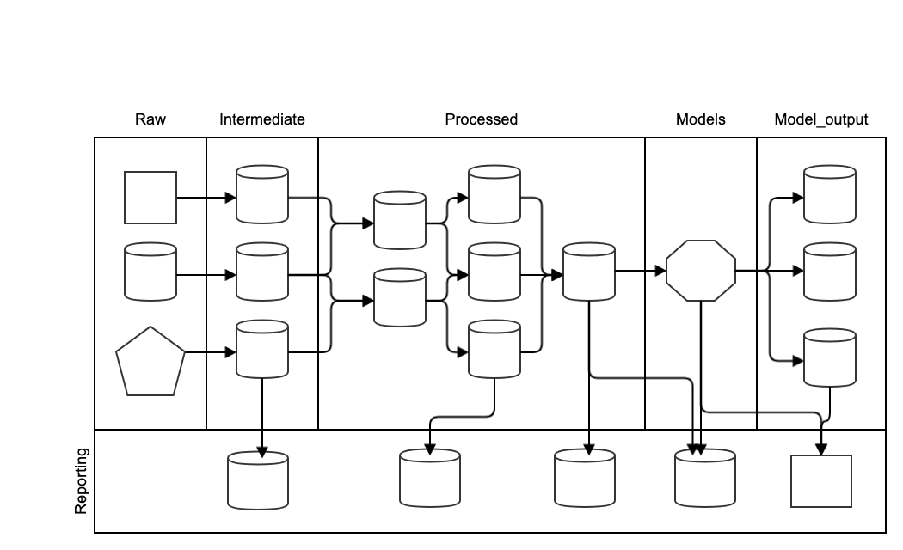

# Pipelines and Project Workflow

## Motivation

Most data-science projects have the same set of tasks:

1. **ETL**: extracting data from its source, transforming it, then loading it into a database. Remember, **ETL** stands for *Extract* , *Transform* and *Load*.
2. **Pre-process data**: This might include imputing missing values and choosing the training and testing sets.
4. **Create features**: Recombine and enrich the data to create features aiding the modelling work.
4. **Train the model(s)**: You can try different algorithms, features, and
so on.
5. Assess performance on the test set: Using an appropriate
metric (e.g. $Precision@k$, $Recall$, $AUC$), examine the performance of your model "out of
sample."
6. Think of new things to try. Repeat steps 1 through 4 as appropriate.

If the code base is not structured and named well, you might be struggling
to remember the details of each step once you have built a few models. 
What features did you use for each?
What training and testing split?  What hyperparameters?

Your code might be getting messy too. Did you overwrite the code for
the previous model? Maybe you copied, pasted, and edited code from an
earlier model. Can you still read what's there? It can quickly become
a hodgepodge that requires heroics to decipher.

In this session, we will introduce a workflow that can avoid (or at least reduce) these problems.

# Data pipelines

It is helpful to structure the data into multiple layers.
In data bases, a layer is expressed as schema.
In most other formats, they are expressed through a directory structure.

##### Raw
The data we receive from the partners and external sources is the raw data. 
Raw data is immutable. Quoting from the popular workflow package [Data Science Cookiecutter](https://drivendata.github.io/cookiecutter-data-science/#data-is-immutable):

Don't ever edit your raw data, especially not manually, and especially not in Excel. 
Don't overwrite your raw data. 
Don't save multiple versions of the raw data. 
Treat the data (and its format) as immutable. 
The code you write should move the raw data through a pipeline to your final analysis. 
You shouldn't have to run all of the steps every time you want to make a new figure (see Analysis is a DAG), but anyone should be able to reproduce the final products with only the code in src and the data in data/raw.


##### Intermediate
If the raw data is messy, it is advisable to create an intermediate layer that consists of tidy copies of the raw data.
Typical situations where this is useful are:
- Data is received in multiple different file types 
- Data fields are not typed (e.g. csv files, excel) or poorly typed (dates as strings, inconsistent date formats)
- Column names are unclear, have spaces, special characters, or there are no column names 

The transformations from raw to intermediate should be limited to fix the issues mentioned above. 
We should not combine different data sets or create calculated fields.
This is reserved for the next layer.

Typical storage formats for the intermediate layer are a data base (e.g. `postgres`) or `parquet` files.

##### Processed
To perform the modelling work, the input data needs to be combined and enriched, for example by creating features. 
The data sets that are created in this process are stored in the processed layer.
Sometimes it can be useful to split this layer out into a domain data model, a feature layer and a master layer but
the exact layering will depend on the project context.

##### Models
The processed data is used to train predictive models, explanatory models, recommender engines and optimisation algorithms.
The trained models are stored in the model layer. 
In contrast to the previous layers, models are usually stored in `pickle` because they are not in tabular format.

##### Reporting
Model performance metrics, predictions, recommendations etc. are stored in the reporting layer.
If a front-end is constructed, it will access the reporting layer to display information to the user.
For example, a Tableau dashboard, power BI, a jupyter notebook or an excel output will read from the reporting layer.
Accordingly, the format of the data in the reporting layer will be adjusted to the front end of choice.  





# Code setup
The code repository will mirror the data pipeline by creating the corresponding folder structure for the python files.

In addition, there are multiple other files that need to be stored and managed.
The community has arrived at a standard setup of the project directories that we will also follow.

Directory structure:

```
├── LICENSE
├── README.md          <- The top-level README for developers using this project.
├── conf
│   ├── base           <- Space for shared configurations like parameters
│   └── local          <- Space for local configurations, usually credentials
│
├── data
│   ├── 01_raw         <- Imutable input data
│   ├── 02_intermediate<- Cleaned version of raw
│   ├── 03_processed   <- The data used for modelling
│   ├── 04_models      <- trained models
│   └── 05_reporting   <- Reports and input to frontend
│
├── docs               <- Space for Sphinx documentation
│
├── notebooks          <- Jupyter notebooks. Naming convention is date YYYYMMDD (for ordering),
│                         the creator's initials, and a short `-` delimited description, e.g.
│                         `20190601-jqp-initial-data-exploration`.
│
├── references         <- Data dictionaries, manuals, and all other explanatory materials.
│
├── results            <- Intermediate analysis as HTML, PDF, LaTeX, etc.
│
├── requirements.txt   <- The requirements file for reproducing the analysis environment, e.g.
│                         generated with `pip freeze > requirements.txt`
│
├── .gitignore         <- Avoids uploading data, credentials, outputs, system files etc
│
└── src                <- Source code for use in this project.
    ├── __init__.py    <- Makes src a Python module
    │
    ├── d00_utils      <- Functions used across the project
    │   └── remove_accents.py
    │
    ├── d01_data       <- Scripts to reading and writing data etc
    │   └── load_data.py
    │
    ├── d02_intermediate<- Scripts to transform data from raw to intermediate
    │   └── create_int_payment_data.py
    │
    ├── d03_processing <- Scripts to turn intermediate data into modelling input
    │   └── create_master_table.py
    │
    ├── d04_modelling  <- Scripts to train models and then use trained models to make
    │   │                 predictions
    │   ├── predict_model.py
    │   └── train_model.py
    │
    ├── d05_reporting  <- Scripts to turn produce reporting tables
    │   └── create_rpt_payment_summary.py
    │
    └── d06_visualisation<- Scripts to create frequently used plots
        └── visualise_patient_journey.py
```


# Workflow

The typical workflow to develop code is the following:

- Prototype code in a jupyter notebook
- Move code into a function that takes data and parameters as inputs and returns the processed data or trained model as output.
- Test the function in the jupyter notebook
- Move the function into the src folder
- Import the function in the jupyter notebook 
- Test the function is working

Functions can be imported into a notebook as follows.
First we tell the notebook where the functions are

    import os
    import sys
    src_dir = os.path.join(os.getcwd(), '..', 'src')
    sys.path.append(src_dir)

Then we state which functions to import

    from d00_utils.my_fun import my_fun

Try it!

# Code pipeline

The code that produces the different layers of the data pipeline should be abstracted into functions.

A *code pipeline* is a set of code that handles all the computational
tasks your project needs from beginning to end. The simplest
pipeline is a set of functions strung together.

For example,

    int_data = create_int_data(raw_data)
    pro_drug_features = create_pro_drug_features
    pro_patient_features = create_pro_patient_features
    pro_master_table = create_pro_master_table(pro_drug_features, pro_patient_features)
    model = train_model(pro_master_table)
    rpt_report = produce_report(model)
    
This is a very schematic example. 
Typically, each step is broken down into a number of subsets creating pipelines for each layer of the data pipeline.
The end-to-end pipeline is then the concatenation of the sub-pipelines. 

## Examples


#### Example 1
Here's a simple
example of a pipeline using `scikit-learn`'s boston dataset:


This pipeline has two steps. The first, called "preprocessing,"
prepares the data for modeling by creating training and testing
splits. 
The second, which called "models, predictions, and metrics,"
uses the preprocessed data to train models, make predictions, and
print $R^2$ on the test set. The pipeline takes inputs (e.g. data,
training/testing proportions, and model types) at one end and produces
outputs (*accuracy*) at the other end.

Obviously, this analysis is incomplete, but the pipeline is a good
start. 
Because we use the same code and data, we can run the pipeline
from beginning to end and get the same results. 
And because we split
the pipeline into functions, we can identify where the pipeline goes
wrong and improve the pipeline one function at a time. (Each function
just needs to use the same inputs and outputs as before.)

Also note the function and loops in the second part of the
pipeline. We're somewhat agnostic about the methods we use. If it
works, great! This structure lets us loop through many types of models
using the same preprocessed data and the same predictions and
metrics. It makes adding new methods and comparing the results easier,
and it helps us focus on other parts of the pipeline, such as feature
generation.

#### Example 2

The [police pipeline](https://github.com/dssg/police-eis), started at
[**DSSG 2015**](https://dssg.uchicago.edu/people/2015-fellows-mentors/), is an example of a relatively well developed pipeline. It
lets us specify the pipeline options we want in a yaml file, from
preprocessing on. (The code in this repository does not include ETL.)
It gives us many modeling options, and it makes comparisons easy.


## Resources

* [Our lead pipeline](https://github.com/dssg/lead-public), started at DSSG 2014
* [Our Cincinnati pipeline](https://github.com/dssg/cincinnati), started at DSSG 2015
* [Triage](https://github.com/dssg/triage) (a generalized DSSG pipeline)


