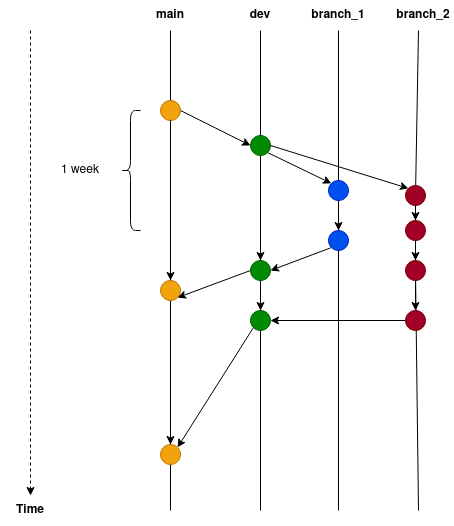

# Git branching and Pull Requests

## Goals of the session

1. Effective branching strategy
2. Create branches
3. Pull requests
4. Merge requests
5. Resolve conflicts

### 1. Effective branching strategy

Why we branch?

At least 2 different branches `main` and `dev` -or `develop`-.


<br>
Based on [Vincent Driessen, A successful git branching model](https://nvie.com/posts/a-successful-git-branching-model)

### 2. Create branches

You can look at the branches that exists with:

```python
$ git branch 
```

You can create a branch using `checkout`

```python
$ git checkout -b your_branch_name
```

You will need to create a branch for each issue, one issue per teammate
, normally different files.

**Characteristics of a good issue**

+ Clear (no ambiguity)
+ Defined output 
+ Could be completed on a few days -ideally one day- 
+ Must be assigned to one person 

For example:

+ Add column `x` to clean table `y`   :)
+ Add method to get top 3 frequent ambulance users   :)
+ Cleaning the data :(


### 3. Pull requests 

Once you've finished your issue you'll need to create a **pull request** so
 that others can check your code. 
 
When you're creating a pull request you should: 

+ Add a concrete summary of your changes 
+ Assign reviewers: The people who is going to review your code. You should
 have at least 1 teammate and your TM. 
+ Assign assignees: 

What you should be reviewing?  

+ Correctness: The code does what is supposed to do -related to the issue-
+ Quality: Your code must fulfill the [PEP8](https://peps.python.org/pep-0008/) standards of the python's code
 style. If your are using an IDE (VSCode, PyCharm, etc.) you are probably
  already "linting" your code.  
+ Efficiency: Your solution is efficient. 
+ Make sure that the base of comparison is `dev` branch!

Pull requests allows us to learn and grow :) 

If you are a reviewer, leave comments -if you have- on the specific line
/chunk of code of interest. 

Let's try it!

### 4. Merge requests 

Once an issue passed a pull request, we can add the code into the "project
" by merging the branch into `dev`. The assignee is the designated person to
 do the merge. 
 
To merge the branch you must change into the branch in which you are merging.

```python
$ git merge your-branch-name
```

If your merge don't have any conflict that's it! 

### 5. Resolve conflicts

Don't panic! 

Having a conflict doesn't mean that you did something wrong, is very common
 to have conflicts. 
 
Solving conflicts is easier if you use an IDE like VSCode or PyCharm, because
 it allows you to see the changes and where are the conflicts. You will need
  to manually decide how to solve the conflict. 
  
Let's try it! 


