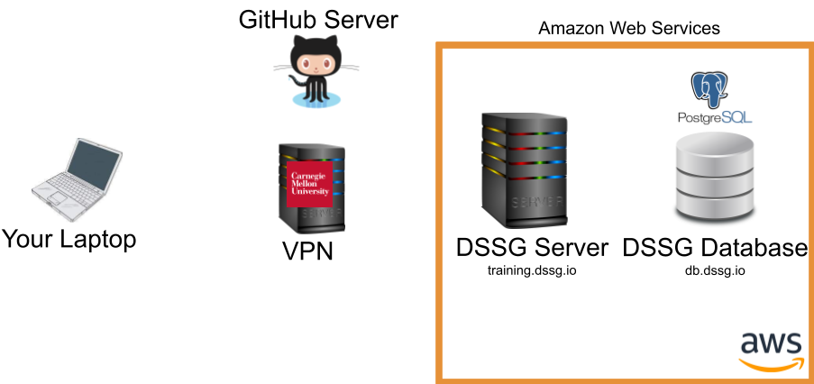

# Technical Workflow and Best Practices


This tutorial is designed to help you understand how to get started with the DSSG computing environment, how to decide what to use your local laptop/desktop for, what to do on the server (and how), and how to go back and forth between different environments and tools on your laptop, the server, and your remote database (an other data resources).

We assume a GNU/linux (Ubuntu) server that's been set up for you, and access to a database (PostgreSQL).

??? note "Looking at this before the summer?"

     Many of the specific instructions here rely on the server and database we'll have set up for you to use during the summer, so you may not be able to follow along yet, but please do read through the workflow here so you'll have an idea what to expect.

## Know Your Infrastructure



In our initial [setup session](setup_session_guide.md), we very briefly talked about the different components of the infrastructure we'll be using this summer. In this tutorial we'll take a bit of a deeper dive into how these different pieces fit together and help you perform different types of tasks.

### Why Remote Infrastructure?

As you'll find there's a bit of overhead (and a learning curve!) to using a remote computing environment. So, why are we making you do it? A few reasons:

1. **Confidentiality:** Most importantly, the data we're using is generally of a sensitive nature and needs to be protected, which means only working with it in a secure computing environment. 

1. **Computing Power and Scalability:** We can use computing resources with much more power than your laptop, and scale them up and down as needed.

1. **Collaboration:** Working in a shared environment with code under version control makes for a much better experience working on a collaborative project.

1. **Learning New Tools:** You're also at DSSG to learn new things, of course, and are likely to encounter many of these (or similar) tools again in the future.

!!! danger "Data Confidentiality"

    Remember that the data we're using is confidential and must stay in our secure computing environment at all times. **Do not download the data to your laptop!**

    Inform DSSG staff immediately if you accidentally download data or your computer or key is compromised!

## Connecting to the Server: SSH

Here's what happens when you connect to the DSSG server via SSH:


The public and private SSH keys are based around two large prime numbers and created in such a way that someone with the public key can encrypt a message that only you can decrypt with your private key (well, or someone with a quantum computer).

!!! danger

    I know it's in big red letters in the image but, really, it's worth repeating: don't share your private key!!

Note that the CMU VPN is also adding an extra layer of encryption and routing all your traffic through the CMU network.

Let's give it a try and explore using the unix command line a bit by working through the [Introduction to Command Line Tools](../../command-line-tools/)

## Talking to the Database with psql

One way to talk to our postgres database is via the `psql` command line tool running directly on the server. To do so, you connect to the server via SSH (as above) then use the `psql` client to reach the database:


## Talking to the Database with DBeaver

Here's where things get a little more complicated: you want to use a nice GUI client for running SQL queries, but to keep the data more secure, we only allow it to be reached from our compute server. To do so, you'll need to encrypt the otherwise less-secure database connection though an **SSH Tunnel**:


Notice that the tunnel (blue) is encrypting your connection to the database (purple) as far as the compute server, where it gets decrypted and forwarded on to the database. Between your laptop and the CMU servers, the CMU VPN (red) does effectively the same thing.

Fortunately, DBeaver has a built-in interface for establishing an SSH tunnel for you, which we set up during the initial [setup session](setup_session_guide.md).

## Using jupyter lab

Another useful tool for some code prototyping and data visualization can be `jupyter lab`. To use it, you'll need to run a `jupyter` server on the compute server and then route your traffic to it from your browser through an SSH tunnel (just as with your dbeaver connection):


Unlike DBeaver, `jupyter lab` doesn't provide a built-in interface for creating the SSH tunnel, so we'll have to do it manually.

There are three components:
- The remote machine (our course server) hosts a jupyter notebook server that does things like loads files, runs python, activates virtual environments
- Your web browser connects to that server and presents a frontend interface for opening, editing, and running notebooks
- These connect using SSH

let's set it up:

1. Connect to the server `ssh {andrewid}@training.dssg.io`

2. Find an open port on the course server to send your Jupyter traffic through:
    - In the terminal (on the course server) type ss -lntu. This will list all ports
    - Pick a port number between 1024 and 65535 that is **NOT on that list**.

3. Navigate to `/mnt/data/projects/food-inspections` to activate your virtual environment (you might need to run `direnv allow` if this is your first time doing so) 
    - If you want to confirm your virtualenv has properly activated, run `which python` 

4. Now, start the jupyter server

```
$ jupyter lab --no-browser --port {Your port from step 2} 
```
(note: to ensure this persists, you may want to start your server in a screen session as discussed above!)

5. When the server starts, take note of the token printed in the server terminal output:


6. On your local machine, set up an SSH tunnel. This will allow your web browser (on your local computer) to reach your Jupyter notebook server (on the course server)


```
$ ssh -i {path to your private key} -N -L localhost:8888:localhost:{ your port from step 2} {andrewid}@training.dssg.io
```

7. Now, we can open the notebook on your local machine:
    - Navigate to http://localhost:8888

    - If this is the first time opening Jupyter, this should take you to a login page asking you to enter the token that was generated (step 5). Copy and paste the token to proceed. 


    - On the next screen (which should be a view of the folders and files in your working directory)


8. To shut down the server, you can return to the screen/terminal window where the server is running and type (1) `ctrl+c` and (2) `y` when prompted.  


## Editing Remotely with VSCode

The easiest way to edit your code (and the one we recommend for the summer) is using a tool, such as VSCode, that provides a GUI text editor on your laptop but allows you to remotely edit the files on the server via SSH:


Note that you'll still need to commit and push your code up to github using the `git` CLI from the server to make sure your teammates have access to your latest changes.

## Editing Files Locally

Another option is to have a copy of the code you're working on locally on your computer and edit it using a local text editor (e.g., sublime, atom, etc.). However, you won't be able to run the code locally (have we mentioned that the data needs to stay in the secure environment we've set up for it?), so you'll need to use github to sync your local edits to the server for testing:


Of course, a third option is to connect to the server via SSH in a terminal and then edit files directly at the command line using a text-based editor such as `vim` or `emacs`, which you're definitely free to do if you're confortable in those environments.


## The Typical Workflow

Now that we've taken a quick tour of some of the common tasks on the DSSG infrastructure, let's see how these pieces fit together into a typical technical workflow:


We'll talk about github in another session, but a good practice to keep in mind is:

- **Every time you resume working** after any break, do a `git pull` to get be sure you're starting from the latest version of the code.

- `git commit` often. Every time you finish a chunk of work, do a `git commit`. `git push` when you've tested it and it is doing what you intended for it to do. Do not push code to the main branch if it breaks. You will annoy your teammates :) Later in the summer, we'll talk more about how to create git branches to make this process a little more resiliant as well.

!!! important "Pro Tip"

    Every time you connect to the server in your terminal use a `screen` session (or `tmux` if you prefer) to ensure your processes remain alive on the server even if your SSH connection drops. This is particularly useful for long-running processes (like modeling jobs or your jupyter server), but a good habit to get in generally.


