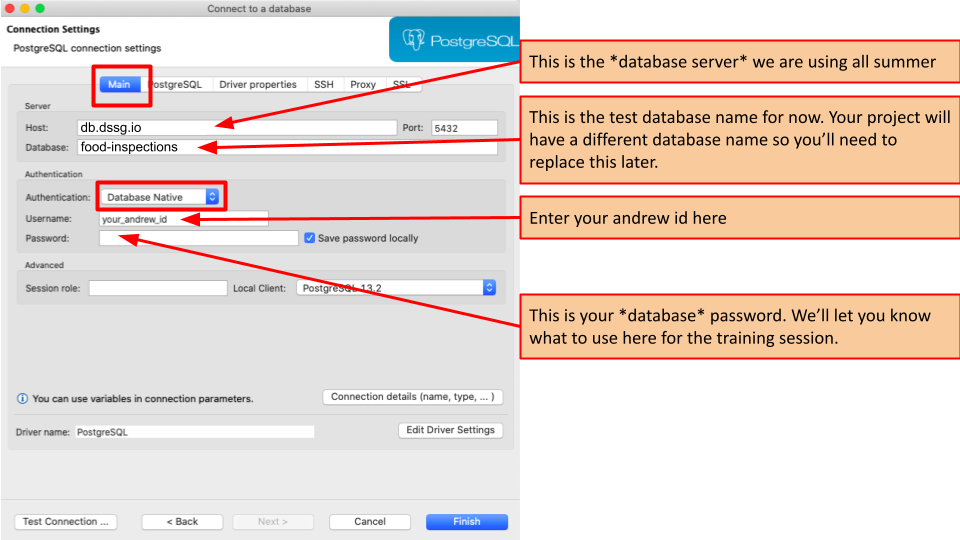

# Software Setup Session

## Motivation

Every team will settle on a specific setup with their tech mentors. This setup will determine, for example:

- which Python version to use
- versioning via virtual environments
- maintaining package dependencies
- continuous testing tools
- your version control workflow.

Today, we're **not** doing that. We're making sure that everybody has some basic tools they will need for the tutorials and the beginning of the fellowship, and that you can log into the server and database. Hopefully you already got many of these tools set up on your computer before arriving, but we'll quickly check that your local enviroment is working (and resolving any lingering issues), and then talk a bit about some of the remote servers and tools we'll be using throughout the summer.

You might not understand every detail of the commands we go through today, but don't worry if not -- we'll go into a lot more detail in the following sessions throughout the week. For today, we just want to be sure everyone has the tools they'll need for working on their projects.

!!! info "Getting help"

    Work through the prerequisites below, making sure that all the software you installed works.

    Affix three kinds of post-it notes to your laptop:

    - one with your operating system, e.g. **Ubuntu 18.04**
    - if you get an app working (e.g. `ssh`), write its name on a **green** post-it and stick it to your screen
    - if you tried - but the app failed - write its name on a **red** post-it

    If you're stuck with a step, ask a person with a corresponding green post-it (and preferrably your operating system) for help.

    The tech mentors will hover around and help with red stickers.

    You will need a few credentials for training accounts. We'll post them up front.

!!! important

    The notes below aren't self-explanatory and will not cover all (or even the majority) of errors you might encounter. Make good use of the people in the room!

Let's get started!

## Windows Users: Setting up WSL

We'll be using a lot of unix-based tools, but fortunately windows now provides a tool called "windows subsystem for linux" (WSL) that provides support for them. If you're using windows and didn't already set up WSL, let's do that now:

[WSL Instructions for Windows](setup_windows.md#windows-subsystem-for-linux-wsl)


## SSH

The data you'll be using for the summer is generally of a sensitive nature and needs to be protected by remaining in a secure compute environment. As such, all of your work directly with the data will be on one of the remote servers we've set up. Let's see how connecting to those resources works:

### Creating an SSH Keypair

The setup information we sent out before the summer had some details on creating an SSH keypair, but if you need to revisit it, you can find that here:

* [Instructions for Windows](setup_windows.md#ssh-keys)
* [Instructions for MacOS/Linux](setup_osx.md#ssh-keys)

### Reaching the Compute Server

Now let's make sure you can connect to the server. In your terminal, type:

```
ssh {your_andrew_id}@training.dssg.io
```

If you got an error about your ssh key, you might need to tell `ssh` where to find the private key, which you can do with the `-i` option:

```
ssh -i {/path/to/your/private_key} {your_andrew_id}@training.dssg.io
```

If you connected successfully, you should see a welcome message and see a prompt like:

```
yourandrewid@dssg-primary: ~$
```

To confirm that you're connected, let's look at the output of the `hostname` command:

* Type `hostname` at the shell prompt and then hit return
* Did you get `dssg-primary`?
    - If so, you're all set! Put a green post-it on the back of your monitor!
    - If not, put a red post-it on the back of your monitor and we'll help you out.

!!! info "PRO tip"

    Your life will be easier if you set up a [`.ssh/config` file](ssh_config.example)


## Accessing the Database

### Reaching the Database from the Compute Server

We'll be using a database running PostgreSQL for much of our project data.

One way to connect to the database is via the command line from the server using `psql`. Since we're already logged onto the server, let's give that a try:

```
$ psql -h db.dssg.io -U {your_andrew_id} food_inspections
```

If all goes well, you should see something like:

```
psql (11.6 (Ubuntu 11.6-1.pgdg18.04+1), server 11.5)
SSL connection (protocol: TLSv1.2, cipher: ECDHE-RSA-AES256-GCM-SHA384, bits: 256, compression: off)
Type "help" for help.

food_inspections=>
```

Let's make sure you can run interact with the server:

* Type `SELECT CURRENT_USER;` and then hit return
* Did you get back your andrew id?
    - If so, you're all set! Put a green post-it on the back of your monitor!
    - If not, put a red post-it on the back of your monitor and we'll help you out.

Finally, exit out of `psql` with `\q`:

```
food_inspections=> \q
```

!!! important "Your postgres password"

    You might have noticed that `psql` didn't ask you for a password when you
    connected to the server. This is because we've stored your password in a
    configuration file called `.pgpass`. You can view it at the bash prompt with:

    ```
    $ cat ~/.pgpass
    ```

    Your password is everything after the last colon:

    ```
    db.dssg.io:5432:*:{andrew_id}:{YOUR_PASSWORD}
    ```

### Reaching the Database from Your Computer

Often it can be a little easier to access the database via GUI system from your computer. To do so, we recommend setting up dbeaver, since it offers a free version and works with every operating system (but if you already have a SQL client like dbvisualizer or data grip that you know how to use and prefer, feel free to use that instead).

!!! important "Protecting your data"

    Although it's fine to run queries and look at the data from a SQL client like dbeaver running on your computer, you should **never** use that client to download an extract of the data (in whole or part) to your local computer, excel, google sheets, etc.

To get DBeaver, you can install it directly from the [DBeaver Website](https://dbeaver.io/download/). NOTE: you'll want to install the free "community edition" version.

Because the database is only accessible from our compute servers, we'll have to use an **SSH Tunnel** to connect to it via dbeaver. Here's how to set that up:

First, create a new connection to a postgres database:


Next, fill in the details for the database server on the window that pops up, following the example below:



Note that your password here can be found in the `.pgpass` file that we looked at on the server.

Finally, to actually reach the database server, we need to set up the SSH tunnel. Under the SSH tab, fill in these details:


You might want to try clicking `Test tunnel configuration` to make sure that's working, then `Test Configuration ...` to ensure you can reach the database.

!!! important "Got an error like `invalid privatekey: [B@7696c31f`?"

    You may need to install a different SSH package called "SSHJ" -- under the Help menu, choose "Install new Software" then search for SSHJ and install the package (you'll need to restart dbeaver). After restarting, choose “SSHJ” in the drop-down under advanced (should be labeled either ”Implementation” or “Method”) when setting up the tunnel

Let's make sure you can connect to the database:

* Try connecting to the database and opening a new sql script
* Type `SELECT CURRENT_USER;` and then press `Ctrl-Enter` to run it
* Did you get back your andrew id?
    - If so, you're all set! Put a green post-it on the back of your monitor!
    - If not, put a red post-it on the back of your monitor and we'll help you out.


## Text Editor

You'll want a good text editor to write code installed on your local machine. We recommend using VSCode because it's both free and allows you to directly edit code stored on a remote machine over SSH (this comes in very handy since all of your code will need to run on the server in order to keep the data in our secure environment). If you already have a different editor that you prefer (e.g., Sublime, PyCharm, emacs, etc.), you're welcome to use that (though note that you may need do some extra work to make sure you keep your local code in sync with the server). 

We sent out some instructions on installing VSCode before the summer, but if you need to revisit them, you can find them below (be sure to install the Remote-SSH extension as well):

* [Instructions for Windows](setup_windows.md#vscode)
* [Instructions for MacOS/Linux](setup_osx.md#text-editor)

!!! info "PRO tip"

    You might also want to install the microsoft python extension, which provides some additional features such as improved auto-completion when coding in python.


### Editing Files Remotely Over SSH

In the same way we set up DBeaver to use SSH to talk to our remote infrastructure, we can set up VSCode to remotely edit files stored on the server using the `Remote-SSH` extension you should have installed in the step above. Let's set that up and make sure we can talk to the server:

1. Configure our training server as an SSH host:

    With the SSH plugin installed, we can tell VSCode how to log into the server. In this step we'll be entering our connection string and saving it in a file, making it easy to connect in the future.

   1. Press `ctrl+shift+p` (Linux/Windows) or `⌘+shift+p` (MacOS) to open the command pallette, and select `Remote-SSH: Connect to Host`
   
   

   2. Select `Add New SSH Host...`
   
   

   3. Enter `ssh {andrewid}@training.dssg.io` (remember from above that you may also need to use the `-i` parameter to tell `ssh` where to find your private key: `ssh -i {path to your private key} {andrewid}@training.dssg.io`)
   
   

   4. Select the first option to store your login config: 
   
   

2. Connect VSCode to the course server:
   1. Connect to the CMU Full VPN
   2. Press `ctrl+shift+p` (Linux/Windows) or `⌘+shift+p` (MacOS) to open the command pallette, and select `Remote-SSH: Connect to Host`
   
   

   3. Select the ssh config we just created: `training.dssg.io`
   
   

   4. Enter your private key passcode if VSCode prompts you to (it will open a box at the top of the screen). 

   5. You should be connected to the training server. This should be indicated in the bottom of your VSCode window: 
   

3. Open a workspace folder:

    Now that VSCode is connected via SSH, you can browse all of the files and folders on the server. In this step, we select a folder containing some code to edit and test.

   1. Select the folder menu button
   
   

   2. Select `Open Folder`
   
         

   3. Select a folder to work in
   
   


## Access from Off-Campus: CMU VPN

For an additional layer of security, our infrastructure can only be reached from from the CMU campus network. As such, if you're not on campus, you'll need to use the CMU VPN to reach the server:

1. Download Cisco Anyconnect VPN client from [here](https://www.cmu.edu/computing/software/all/cisco-anyconnect/index.html) and install it

2. Open the Anyconnect client

3. Enter login credentials (be sure to select the "Full VPN" Group):
    - Connect to: vpn.cmu.edu
    - Group: “Full VPN”
    - Username: your andrewid
    - Password: your CMU password

4. Click connect


## Understanding The "Big Picture"

Finally, before we go, let's take a minute to zoom out to the "big picture" of the infrastructure we'll be using and see how all these pieces fit together:


## Other (Optional) Local Tools

Most of your work this summer will be on the remote server for your project, but there are a few of other tools that might be handy to have installed locally if you feel inclined:

- Python (using pyenv) and jupyterlab [[windows](setup_windows.md#setting-up-python-and-related-tools)] [[macos/linux](setup_osx.md#python)]
- Github client [[windows](setup_windows.md#git-and-github-account)] [[macos/linux](setup_osx.md#git-and-github-account)]
- psql CLI [[windows](setup_windows.md#database)] [[macos/linux](setup_osx.md#psql)]
- [Tableau](https://www.tableau.com/academic/students) is a good tool to explore and visualize data without using any programming. If you’re a student, you can request a free license.


